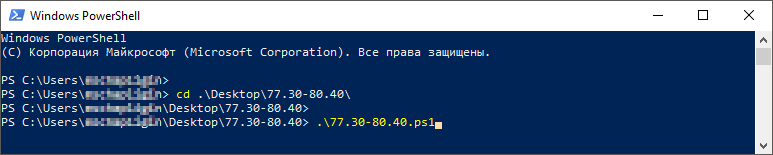
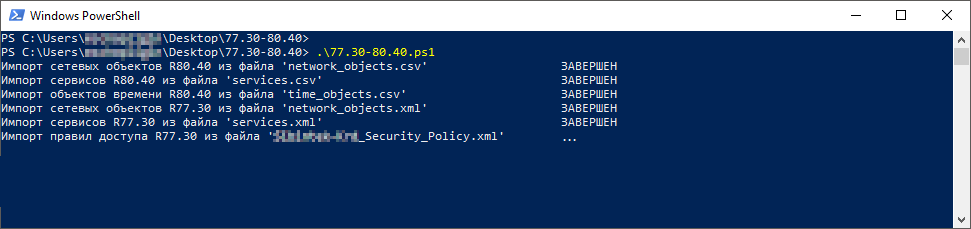
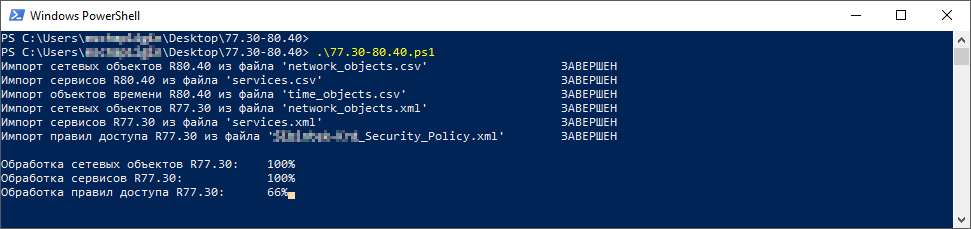
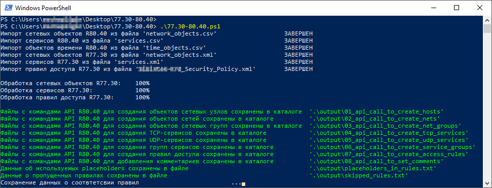
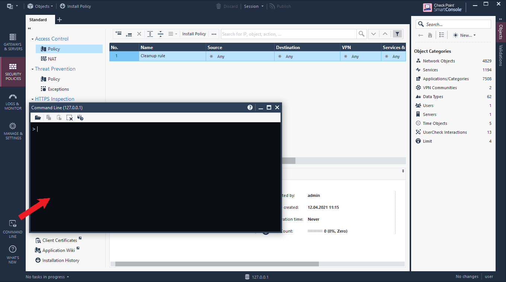
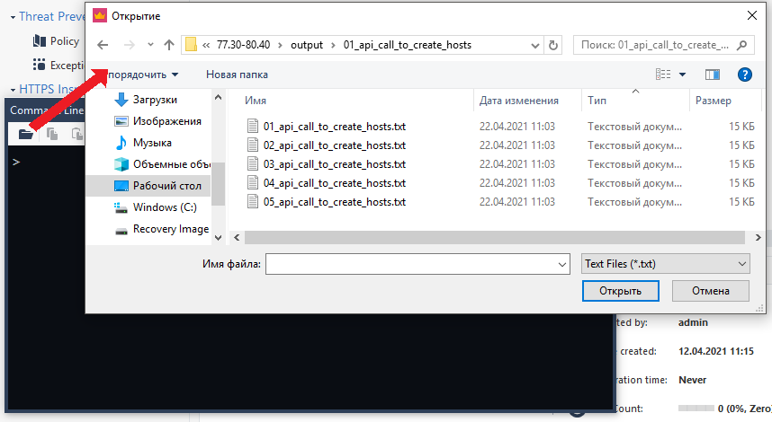
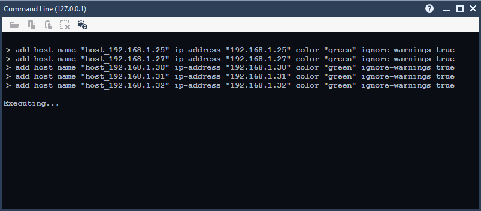
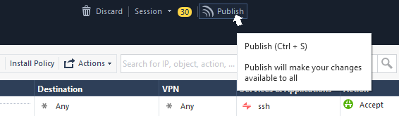

# 77.30-80.40
**77.30-80.40** – это скрипт для конвертации сетевых объектов, сервисов и правил доступа из версии R77.30 в набор команд API версии R80.40 серверов управления Check Point.

Корневой каталог *77.30-80.40* содержит следующие файлы и папки:

| Файл/каталог  |  Описание |
| ------------ | ------------ |
| *conf* | Каталог содержит файл *config.ps1*, который является файлом конфигурации для работы скрипта. |
| *input* | Каталог содержит папки *from_77.30* и *from_80.40*. Перед запуском скрипта, в каталог *from_77.30* нужно скопировать файлы экспортированных сетевых объектов, сервисов и правил из сервера управления версии R77.30; в каталог *from_80.40* нужно скопировать файлы экспортированных сетевых объектов, сервисов и объектов времени из сервера управления версии R80.40. |
| *output* | Каталог, в котором будут сохранены результаты отработки скрипта. |
| *pictures* | Каталог содержит картинки для файла *README.md* |
| *src* | Каталог содержит файл *functions.ps1*. Этот файл содержит исходный код пользовательских функций. |
| *tools* | Каталог содержит скрипт-обёртку над утилитой *cpdb2web* для экспорта объектов и правил версии R77.30. |
| *77.30-80.40.ps1* | Скрипт конвертации. |
| *README.md* | Информация об использовании данного скрипта. |

## config.ps1
Перед запуском скрипта следует отредактировать файл конфигурации *config.ps1*. 

Файл конфигурации содержит следующие поля:

| Поле конфигурации|  Описание |
| ------------ | ------------ |
|*R80.40_layer_name*|Имя слоя "Access Control" для доменной политики. Узнать имя слоя можно с помощью смарт-консоли R80.40 в меню "Manage policies and layers".|
|*R80.40_start_rule_number*|Номер начального правила доменной политики R80.40.|
|*R77.30_rule_range*|Диапазон правил политики R77.30, которые нужно конвертировать.|
|\\-- *start_rule_number*|Номер начального правила.|
|\\-- *last_rule_number*|Номер последнего правила.|
|*firewall_name*|Раздел настроек, содержащий отображение имен межсетевых экранов для версий R77.30 и R80.40.|
|\\-- *<имя межсетевого экрана в R77.30>*|В качестве названия поля указывается имя межсетевого экрана в R77.30, а в качестве значения указывается имя межсетевого экрана в R80.40.|
|*vpn_name*|Раздел настроек, содержащий отображение имен VPN Communities для версий R77.30 и R80.40.|
|\\-- *<имя VPN Community в R77.30>*|В качестве названия поля указывается имя VPN Community в R77.30, а в качестве значения указывается имя VPN Community в R80.40.|
|*special_date*|Даты окончания временных правил, записанные в особенном формате метки времени, отличающемся от стандартного шаблона.|
|\\-- *<метка времени>*|В качестве названия поля указывается метка времени, а в качестве значения указывается дата.|
|*placeholder*|Заполнители для объектов, которые могут встретиться в правилах доступа R77.30, но при этом отсутствуют, по какой-то причине в экспортированных объектах R77.30.|
|\\-- *src/dst_field*|Имя объекта-заполнителя для сетевых объектов.|
|\\-- *service_field*|Имя объекта-заполнителя для сервисов.|
|*color*|Раздел настроек, содержащий отображение цвета объектов для версий R77.30 и R80.40.|
|\\-- *<название цвета в R77.30>*|В качестве названия поля указывается название цвета в R77.30, а в качестве значения указывается название цвета в R80.40.|

Пример файла конфигурации:
```
$config = @{
    
    'R80.40_layer_name' =    "Some_Company Network";
    
    'R80.40_start_rule_number' =    57;
    
    'R77.30_rule_range' = @{
        'start_rule_number' =    209;
        'last_rule_number' =     309
    };
    
    'firewall_name' = @{
        'fw-Krd-Comp-St-21' =    "fw-Some_Company-Krd-St-21"
    };
    
    'vpn_name' = @{
        'RemoteAccess' =      "RemoteAccess";
        'gVPN_ORG_POINT' =    "VPN_TMP"
    };
    
    'special_date' = @{
        'quarantine' =    "28.02.2021"
    };
    
    'placeholder' = @{
        'src/dst_field' =    "SRC_DST_TMP";
        'service_field' =    "SERVICE_TMP"
    };
    
    'color' = @{
        'deepskyblue1' =    "sky blue";
        'gold3' =           "dark gold";
        'orange' =          "orange";
        'olive drab' =      "olive";
        'aquamarine1' =     "aquamarine";
        'forest green' =    "forest green";
        'magenta' =         "magenta";
        'blue1' =           "dark blue";
        'blue' =            "crete blue";
        'dodgerblue3' =     "blue";
        'yellow' =          "yellow";
        'sienna' =          "sienna";
        'red' =             "red"
    }
}
```

## 77.30-80.40.ps1
Данный скрипт производит конвертацию объектов узлов, сетей, сетевых групп, сервисов, групп сервисов и правил доступа версии R77.30 в команды API (v1.6) версии R80.40 для серверов управления Check Point.

Файлы с объектами и правилами версии R77.30 в формате XML следует скопировать в каталог *input/from_77.30*, после чего каталог будет содержать:

| Файл|  Описание |
| ------------ | ------------ |
|*network_objects.xml*|Файл с объектами узлов, сетей и сетевых групп версии R77.30.|
|*services.xml*|Файл с сервисами и группами сервисов версии R77.30.|
|*{NAME}_Security_Policy.xml*|Файл политики с правилами доступа версии R77.30.|

Во время отработки скрипта, будут создаваться команды API версии R80.40 с учетом свойств объектов из версии R77.30. Может возникнуть ситуация, когда на сервере управления версии R80.40 уже имеется объект с таким же именем, как и объект в R77.30. При попытке создать на сервере управления объект с именем, которое уже используется, произойдет ошибка. Чтобы исключить эту ситуацию, предварительно нужно скопировать в каталог *input/from_80.40* файлы экспортированных сетевых объектов, сервисов и объектов времени версии R80.40 в формате CSV, после чего каталог будет содержать:

| Файл|  Описание |
| ------------ | ------------ |
|*network_objects.csv*|Файл с объектами узлов, сетей и сетевых групп версии R80.40.|
|*services.csv*|Файл с сервисами и группами сервисов версии R80.40.|
|*time_objects.csv*|Файл c объектами времени версии R80.40.|

Теперь в командной строке PowerShell, перейдя в каталог *77.30-80.40*, можно запустить скрипт:


Скрипт импортирует файлы из каталогов *input/from_77.30* и *input/from_80.40*:


Затем cкрипт обработает объекты и правила доступа R77.30:


Результаты отработки скрипта будут сохранены в каталоге *output*:


## output
В общем случае, по результатам отработки скрипта, каталог *output* будет содержать следующие файлы и каталоги:

| Файл/каталог |  Описание |
| ------------ | ------------ |
|*01_api_call_to_create_hosts*|Каталог содержит текстовые файлы с командами API R80.40 для создания объектов сетевых узлов.|
|*02_api_call_to_create_nets*|Каталог содержит текстовые файлы с командами API R80.40 для создания объектов сетей.|
|*03_api_call_to_create_net_groups*|Каталог содержит текстовые файлы с командами API R80.40 для создания объектов сетевых групп.|
|*04_api_call_to_create_tcp_services*|Каталог содержит текстовые файлы с командами API R80.40 для создания TCP-сервисов.|
|*05_api_call_to_create_udp_services*|Каталог содержит текстовые файлы с командами API R80.40 для создания UDP-сервисов.|
|*06_api_call_to_create_service_groups*|Каталог содержит текстовые файлы с командами API R80.40 для создания групп сервисов.|
|*07_api_call_to_create_access_rules*|Каталог содержит текстовые файлы с командами API R80.40 для создания правил доступа.|
|*08_api_call_to_set_comments*|Каталог содержит текстовые файлы с командами API R80.40 для добавления комментариев к правилам доступа.|
|*placeholders_in_rules.txt*|Информация о заполнителях (placeholders), которые будут использованы при создании правил доступа.|
|*skipped_rules.txt*|Информация о правилах доступа R77.30, которые были пропущены во время конвертации.|
|*rule_map.txt*|Информация о соответствии правил доступа R77.30 и R80.40.|

Каталоги, содержащие текстовые файлы с командами API, пронумерованы. Также пронумерованы и сами текстовые файлы с командами API, которые находятся внутри этих каталогов. Данная нумерация организует очередность, которую следует соблюдать при загрузке файлов с командами API в смарт-консоли R80.40.

Например, если сразу начать загрузку файлов с командами API для создания объектов сетевых групп (расположены в каталоге *03_api_call_to_create_net_groups*), то выполнение загруженных команд завершится с ошибками, т.к. ранее не были созданы объекты сетевых узлов и сетей, которыми должны наполняться сетевые группы.

Особенно важно соблюдать данную очередность при загрузке файлов с командами API для создания правил доступа (расположены в каталоге *07_api_call_to_create_access_rules*). Т.к. последовательная загрузка от первого файла до последнего гарантирует очередность создания правил доступа на сервере управления R80.40 и их расположение в порядке, соответствующем порядку на сервере управления R77.30.

Для загрузки файлов с командами API нужно в смарт-консоли R80.40 открыть окно COMMAND LINE:


Затем в окне COMMAND LINE открыть нужный файл:


Команды API из загруженного файла будут выполняться последовательно:


После окончания выполнения команд следует нажать кнопку Publish чтобы внесенные изменения были приняты:



Таким образом, поочередно загружая файлы с командами API и публикуя внесенные изменения, на сервере управления R80.40 будут созданы сетевые объекты, сервисы и правила доступа.

Более подробно ознакомиться с функционалом API версии R80 сервера управления Check Point можно на официальном [сайте](https://sc1.checkpoint.com/documents/latest/APIs/?#gui-cli/introduction~v1.6%20).

Кроме файлов с командами API, скрипт *77.30-80.40.ps1* создает файлы со служебной информацией.
Файл *rule_map.txt* содержит информацию о соответствии правил доступа R77.30 и R80.40. Например, следующие строки этого файла:
> 209 -> 57.1

> 210 -- skipped: время 'do31072020' действия правила истекло

> 211 -> 57.2

информируют о том, что:
- правило доступа № 209 из R77.30 будет создано в R80.40 с номером 57.1;
- правило доступа № 210 из R77.30 пропущено, т.к. это временное правило с истекшим сроком действия, и оно не будет создано в R80.40;
- правило доступа № 211 из R77.30 будет создано в R80.40 с номером 57.2.

Файл *skipped_rules.txt* информирует о правилах доступа R77.30, которые были пропущены во время конвертации. Его содержимое может быть, например, таким:
> 210 -- skipped: время 'do31072020' действия правила истекло

> 239 -- skipped: время 'do28022020' действия правила истекло

По разным причинам может возникнуть ситуация, когда в экспортированных правилах доступа R77.30 есть объект политики (узел, сеть или сервис), а в экспортированных сетевых объектах и сервисах R77.30 этого объекта нет. Соответственно, если на этапе конвертации правил доступа формировать команду API с таким объектом, то в последствии, на этапе выполнения этих команд в COMMAND LINE смарт-консоли, будет получена ошибка и правило не будет создано, т.к. этот объект не был учтен при конвертации сетевых объектов и сервисов. Чтобы исключить эту ситуацию, подобные отсутствующие объекты будут заменены на заполнители (placeholders). В данном случае placeholder – это сетевой объект или сервис, который заранее нужно создать на сервере управления R80.40, и внести его название в файле конфигурации *config.ps1*.

Это также касается глобальных сетевых объектов и сервисов. Подобные объекты не могут быть созданы на локальном уровне. И потенциально не исключена ситуация, когда при переводе организации на сервер управления R80.40, некоторые глобальные объекты будут отсутствовать на нем.

Для объектов типа Legacy User Access это тоже справедливо.

Соответственно файл *placeholders_in_rules.txt* информирует об используемых объектах placeholders, при создании правил доступа R80.40. Его содержимое может быть, например, таким:
> 228 -> 57.20 placeholders

> &nbsp;&nbsp;&nbsp;&nbsp;source SRC_DST_TMP: g_DC01.some.ru, g_DC02.some.ru

> &nbsp;&nbsp;&nbsp;&nbsp;destination SRC_DST_TMP: g_DC3000.nipi.some.ru

> &nbsp;&nbsp;&nbsp;&nbsp;services SERVICE_TMP: g_wb_5985, g_wb-ssl_5986

> 294 -> 57.86 placeholders

> &nbsp;&nbsp;&nbsp;&nbsp;source SRC_DST_TMP: AD_SOME_USR@Any

что означает следующее:
- правило доступа № 228 из R77.30 будет создано в R80.40 с номером 57.20; в столбце **Source** заполнитель *SRC_DST_TMP* заменит объекты *g_DC01.some.ru* и *g_DC02.some.ru*; в столбце **Destination** заполнитель *SRC_DST_TM* заменит объект *g_DC3000.nipi.some.ru*; в столбце **Services & Applications** заполнитель *SERVICE_TMP* заменит сервисы *g_wb_5985* и *g_wb-ssl_5986*;
- правило доступа № 294 из R77.30 будет создано в R80.40 с номером 57.86; в столбце **Source** заполнитель *SRC_DST_TMP* заменит объект *AD_SOME_USR@Any*.
